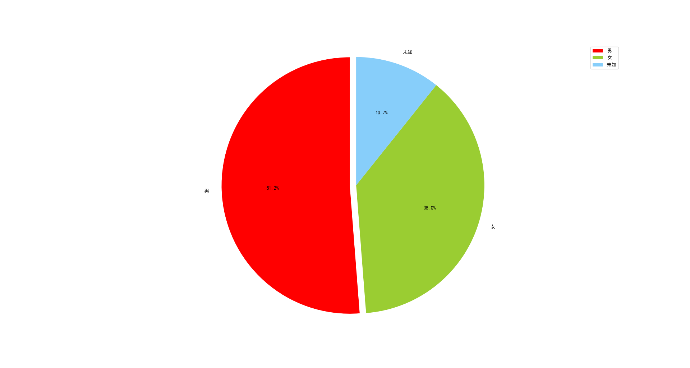
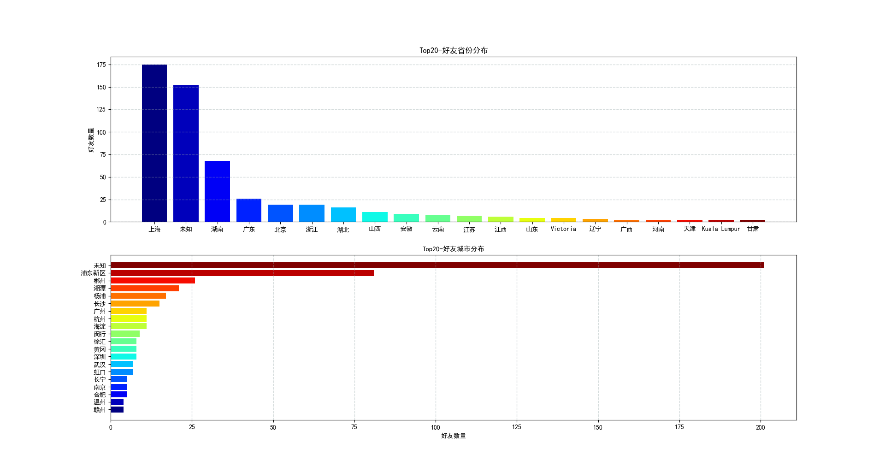
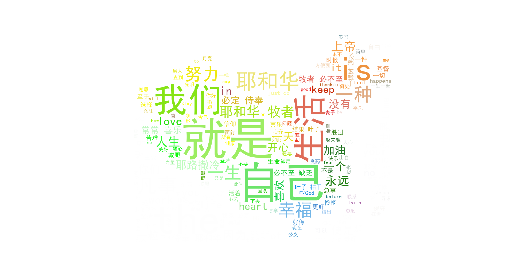

## 功能介绍
通过简单的数据分析了解微信好友的总体情况

## 具体功能
1. 统计好友性别分布，省份及城市分布，生成好友签名的词云
2. 生成好友头像的照片墙
3. 根据个性签名对好友进行聚类

## 功能1：好友统计
1. **安装包**
 * itchat
 * jieba
 * wordcloud
2. **使用说明**
 * 运行文件 [WeChat_friend_statistics.py](WeChat_friend_statistics.py)
 * 手机微信扫码并确认登录， 当前目录会生成[itchat.pkl](itchat.pkl)文件，用于保存登录状态，下次运行直接手机确认即可。如需换号登录，可以先将该文件删除
 * 运行结果会保存[memberList.csv](memberList.csv)文件，包含好友的如下信息：昵称、性别（0-未知，1-男，2-女）、省份、城市、签名

|  NickName   | Sex  | Province  | City  | Signature  |
|  :----:  | :----:  | :----:  | :----:  | :----:  |
| \*\*nickName\*\*  | 1 | 湖南 | 邵阳 | 盼望着，离回家的路似乎还很漫长，等我，等我 |
| ...  |...  |...  |...  |...  |

 * 运行结果会弹出3张图：好友性别分布的饼图、好友省份及城市分布的柱状图、好友签名的词云图

## 功能2：好友头像照片墙
1. **安装包**
 * wxpy
 * PIL
2. **使用说明**
 * 运行文件 [wechat_friend_wall.py](wechat_friend_wall.py)
 * 手机微信扫码并确认登录后，程序会会将所有好友头像保存到文件夹[FriendImages](FriendImages)
 * 最后程序从FriendImages文件夹中读取图片，并在当前目录会生成照片墙图片文件[wechat_friend_wall.jpg](wechat_friend_wall.jpg)

注：为保护隐私，上传的好友照片墙图片已被模糊化处理

## 功能3：好友聚类
1. **安装包**
 * jieba
2. **使用说明**
 * 运行文件 [signature_split.py](signature_split.py)
    * 该程序读取[memberList.csv](memberList.csv)文件，并调用[jieba_cut.py](jieba_cut.py)对签名进行分词
    * [stopwords.txt](stopwords.txt)文件对jieba分词结果删除停用词处理的停用词配置文件
    * 程序运行结果输出两个文件：[No_NickName_Signature.csv](No_NickName_Signature.csv),[wordclustering/sourcedata/source_file](wordclustering/sourcedata/source_file)
 * 运行文件[wordclustering/keyword.py](wordclustering/keyword.py)，注：该文件由Python2.7编写，所以请在Python2.7环境下运行。除此之外，本项目代码均采用Python3编写
    * 该程序读取[source_file](wordclustering/sourcedata/source_file)，对好友进行聚类
    * 程序运行结果在wordclustering\sourcedata目录下输出三个文件
      * [wordclustering/sourcedata/gender](wordclustering/sourcedata/gender): 各类别的统计
      * [wordclustering/sourcedata/keyword](wordclustering/sourcedata/keyword): 各类别包含的主要关键词及权重
      * [wordclustering/sourcedata/result](wordclustering/sourcedata/result): 具体每个好友编号的类别归属、签名分词及主要起作用的关键词
 * 运行文件[process_clustering_results.py](process_clustering_results.py)
    * 该程序读取[wordclustering/sourcedata/result](wordclustering/sourcedata/result)和[No_NickName_Signature.csv](No_NickName_Signature.csv)两个文件，对聚类进行整理
    * 该程序输出聚类的最终结果文件[cluster_result.txt](cluster_result.txt)
3. **聚类结果分析**

* 聚类算法采用类似K-Means的方法进行聚类，去掉关键词权重相对太小的类别，统一放在未分类

|  类别号   | 好友数  |
|  :----:  | :----:  |
| 0  | 34 | 
| 1  | 30  |
| 2  | 20 | 
| 3  | 29  |
| 未分类  | 455  |

 * 各类别分析
    * 第0类主要是和"心"相关的
    * 第1类主要是和"爱"相关的
    * 第2类主要是和"人"相关的
    * 第3类主要是和"要"相关的
 * 能够分到类别的好友，说明有很多其他好友也有相似的签名，具有相近的价值取向；未分到类别的，要么是没有签名，要么是签名比较有自己的特色导致没有相似签名的好友。大多数好友都没有分到类别，这正是印证了圣经上的几句话：「赛53:6」 我们都如羊走迷，各人偏行己路，...

注：为保护隐私，本项目上传文件的好友昵称均用"\*\*nickName\*\*"代替